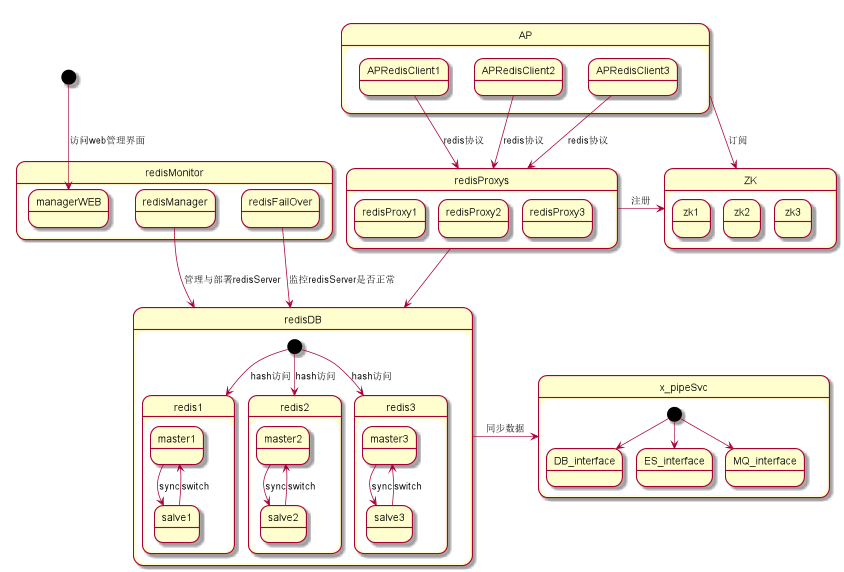
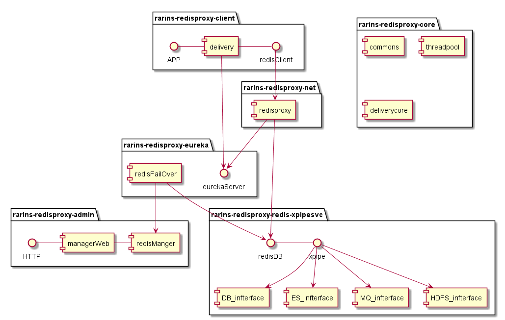

rains-redisproxy
================

rains-redisproxy 是一个开源Redis中间件服务，支持redis协议通信，使用普通的redis客户端即可，无须修改业务应用程序任何代码与配置，与业务解耦；
以netty 作为通信传输工具，让它具有高性能，高并发，可分布式扩展部署等特点；使用用eureka做redisProxy服务注册与发现中心使得分布式扩展部署更加
简单，配置更加简洁。

 # Features

  * **框架特性**
 
      * 自带连接池，简单稳定且性能高效。

      * 支持读写分离，可配置调度算法 。

      * 默认支持一致性哈希分片策略，扩展性强 。

      * 支持HA 分布式部署，节点可随意扩展。

      * 管理监控功能丰富，可自动增加减少redis节点部署。

      * 使用eureka可以自动注册发现服务，动态调整有效节点，减少配置。

 * ***redisproxy角色***

   * AP应该使用普通redis客户端访问redisProxy

   * redisProxy核心部分，实现redis协议通信，通过调度算法，访问redis

   * 注册中心eureka,使用得redisPoxy自动注册发现。
   
   * redisProxy管理应用，通过界面可以部署与监控redis。
   
    * xpipe同步所有redis节点的数据，备份缓存数据、跨机房数据同步、缓存数据热备(todo)。

 * ***技术方案***

   * redisProxy通过netty实现redis的通信协议与客户端、redis主从访问，redisProxy采用eureka做注册中心达到自动注册发现redisProx服务，做到高可用。

   * AP要访问redisProxy通过普通redis客户端即可；也可加入eureka客户端达到自动发现redisProxy的服务。
   
   * 通过伪装redis的slave对redis数据统一备份，与第三方系统对接，例如实时计算平台等(todo)

# Design
 ### [架构设计]
 *      redisProxy总体架构设计(初稿)
 
  *     redisProxy模块大体设计(初稿)
 

#   Configuration

  ###  [配置详解](https://github.com/hugoDD/rains-redisproxy/wiki/configuration%EF%BC%88%E9%85%8D%E7%BD%AE%E8%AF%A6%E8%A7%A3%EF%BC%89)

# Prerequisite

  *   #### JDK 1.8+

  *   #### Maven 3.2.x

  *   #### Git

  *   ####  netty 。

# Quick Start

 ### [Quick Start](https://github.com/hugoDD/rains-redisproxy/wiki/QuickStart)

  

# User Guide

###  [demo](https://github.com/hugoDD/rains-redisproxy/wiki/demo)

# FAQ

* ### 为什么我下载的代码后，用idea打开没有相应的get set 方法呢？
   ##### 答：因为框架使用了Lombok包，它是在编译的时期，自动生成get set方法，并不影响运行，如果觉得提示错误难受，请自行下载lombok包插件，[lombok官网](http://projectlombok.org/)

