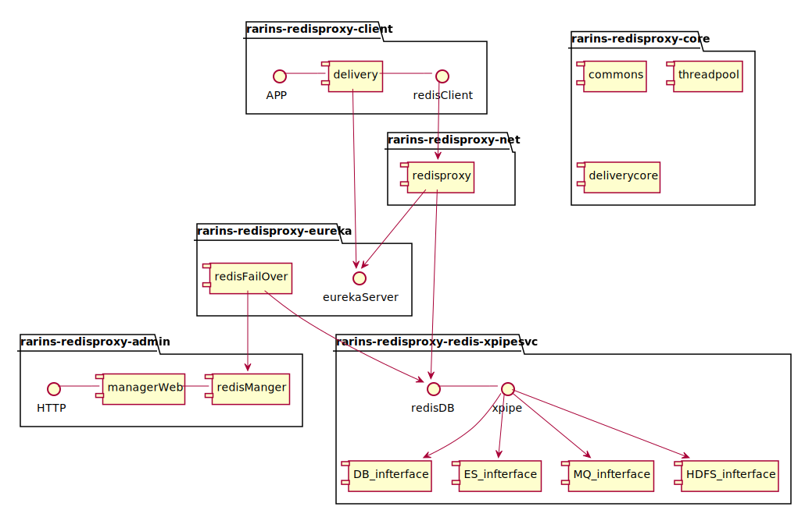

rains-redisproxy
================

rains-redisproxy 是一个开源Redis中间件服务，支持redis协议通信，使用普通的redis客户端即可，无须修改业务应用程序任何代码与配置，与业务解耦；
以netty 作为通信传输工具，让它具有高性能，高并发，可分布式扩展部署等特点；使用用eureka做redisProxy服务注册与发现中心使得分布式扩展部署更加
简单，配置更加简洁。

 # Features

  * **框架特性**
 
      * 支持redis通信协议,原有的程序无须改变。

      * 使用eureka,ribbin组件，使得redisProxy自动注册发现与负载 。

      * 默认支持一致性哈希分片策略，扩展性强 。

      * 支持HA 分布式部署，节点可随意扩展。

      * 管理监控功能丰富，可自动增加减少redis节点部署(todo)。

      * 使用eureka可以自动注册发现服务，动态调整有效节点，减少配置。

 * ***redisproxy角色***

   * AP应该使用普通redis客户端访问redisProxy

   * redisProxy核心部分，实现redis协议通信，通过调度算法，访问redis

   * 注册中心eureka,使用得redisPoxy自动注册发现。
   
   * redisProxy管理应用，通过界面可以部署与监控redis。
   
    * xpipe同步所有redis节点的数据，备份缓存数据、跨机房数据同步、缓存数据热备(todo)。

 * ***技术方案***

   * redisProxy通过netty实现redis的通信协议与客户端、redis主从访问，redisProxy采用eureka做注册中心达到自动注册发现redisProx服务，做到高可用。

   * AP要访问redisProxy通过普通redis客户端即可；也可加入eureka客户端达到自动发现redisProxy的服务。
   
   * 通过伪装redis的slave对redis数据统一备份，与第三方系统对接，例如实时计算平台等(todo)

# Design
 ### [架构设计]
 *      redisProxy总体架构设计(初稿)
 
  *     redisProxy模块大体设计(初稿)
 

#   Configuration

    redisproxy:
      redisPool:
        connectionTimeout:  5000#链接超时
        maxActiveConnection:  100 #最大连接数
        maxIdleConnection:  80
        minConnection:  10  #最小连接数
        maxWaitMillisOnBorrow:  500  #等待borrow最大时间
        initialConnection:  5 #初始连接数
        timeBetweenEvictionRunsMillis:  60000  
        minEvictableIdleTimeMillis: 300000
        minIdleEntries: 1
        testOnBorrow: true  #获取时是否检验有效性
        testOnReturn: true  #回收时是否检验有效性
        testWhileIdle:  true ##使用时是否检验有效性
      groupNode:
        - redisMasters :
           -  host: 172.26.223.109  #主redis ip
              port: 16379           #主redis 端口
              redisSlaves:          
                - host: 172.26.223.109  #从redis ip
                  port: 26379           #从redis端口
                - host: 172.26.223.109  #从redis ip
                  port: 6379            #从redis端口
    #       -  host: 172.26.223.108     #主redis ip
    #          port: 16379              #主redis 端口
    #          redisSlaves:
    #            - host: 172.26.223.110  #从redis ip
    #              port: 26379           #从redis端口
    #            - host: 172.26.223.111  #从redis ip
    #              port: 36379           #从redis端口

  
# Prerequisite

  *   #### JDK 1.8+
  
  *   ### springboot eureka ribbin

  *   #### Maven 3.2.x

  *   #### Git

  *   ####  netty 。

# Quick Start

 ### [Quick Start](https://github.com/hugoDD/rains-redisproxy/wiki/QuickStart)

  

# User Guide

###  [demo](https://github.com/hugoDD/rains-redisproxy/wiki/demo)

# 性能测试
### 直连redis使用jhm测试

| Benchmark                           |  Mode  | Cnt |   Score |     Error  | Units |
| :-                                  | :-     | :-  | :-       | :-        | :-    |  
| RedisClientJhmTest.redisGetCmd      |  thrpt |  20 | 436.251 | ± 109.164 | ops/s |
| RedisClientJhmTest.redisHgetCmd     |  thrpt |  20 | 446.744 | ±  74.614 | ops/s |
| RedisClientJhmTest.redisHsetCmd     |  thrpt |  20 | 431.811 | ±  62.996 | ops/s |
| RedisClientJhmTest.redisListPopCmd  |  thrpt |  20 | 472.401 | ±  74.417 | ops/s |
| RedisClientJhmTest.redisListPushCmd | thrpt  | 20  | 501.044 | ±  25.642 | ops/s |
| RedisClientJhmTest.redisSetCmd      | thrpt  | 20  | 440.543 | ±  67.428 | ops/s |  

### 直连proxy使用jhm测试

|Benchmark                            |Mode   | Cnt  |  Score  |  Error   |Units |
|:-                                   |:-      | -:  | -:      |  -       | :-    |
|RedisClientJhmTest.proxyGetCmd       |thrpt   | 20  | 306.951 |± 38.230 | ops/s |
|RedisClientJhmTest.proxyHgetCmd      |thrpt   | 20  | 316.415 |± 17.515 | ops/s |
|RedisClientJhmTest.proxyHsetCmd      |thrpt   | 20  | 242.959 |± 82.894 | ops/s |
|RedisClientJhmTest.proxyListPopCmd   |thrpt   | 20  | 260.596 |± 85.742 | ops/s |
|RedisClientJhmTest.proxyListPushCmd  |thrpt   | 20  | 291.199 |± 46.258 | ops/s |
|RedisClientJhmTest.proxySetCmd       |thrpt   | 20  | 332.892 |± 35.410 | ops/s |

# FAQ

* ### 为什么我下载的代码后，用idea打开没有相应的get set 方法呢？
   ##### 答：因为框架使用了Lombok包，它是在编译的时期，自动生成get set方法，并不影响运行，如果觉得提示错误难受，请自行下载lombok包插件，[lombok官网](http://projectlombok.org/)

