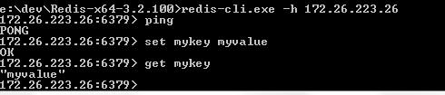

# Demo介绍
# 1. rains-redisproxy可以有几种使用场景
* 直接当作redis集群的代理服务，原有的程序不需要任何改变。
* 通过eureka和客户端，自动发现rains-redisproxy,只需要引用rains-redisproxy-client然后使用eureka客户端。

# 2. 直接当作redis集群的代理服务demo
* java -jar server-demo-1.0.0-RELEASE.jar &
* 使用redis-cli 直接访问 redisProxy服务



# 3. 通过eureka和客户端，自动发现rains-redisproxy
* 启动注册中心 eureka  
    * >java -jar rains-redisproxy-eureka-1.0.0-RELEASE.jar &
* 在提供的demo样例中，rains-redisproxy-sample模块，有
    * client-demo 是访问redisproxy的客户端demo
    * server-demo 是启动redisproxy的服务端demo

* 在服务端demo的application.yml和SocketApplication分别配置,然后启动SocketApplication.java
````
eureka:
  client:
    service-url:
      defaultZone:  http://localhost:8761/eureka/
  instance:
    prefer-ip-address: true # 注册时使用ip而不是主机名
    instance-id:  ${spring.cloud.client.ipAddress}:${server.port}
```` 
````   
@EnableEurekaClient
@EnableFeignClients
@SpringBootApplication
@EnableAutoConfiguration
public class SocketApplication   implements CommandLineRunner {
    public static void main(String[] args) {

        ConfigurableApplicationContext commonContext =
                new SpringApplicationBuilder(SocketApplication.class).web(false).run(args);
        commonContext.addApplicationListener(new ApplicationPidFileWriter());
    }
    @Override
    public void run(String... args) throws Exception {
        Thread.currentThread().join();
    }
}

````
* 在客户端client-demo配置application.properties和SampleRedisApplication.jar,并且启动SampleRedisApplication
````
spring.application.name=test
server.port=8888
eureka.client.service-url.defaultZone=http://localhost:8761/eureka/
#redis
#redisProxy的服务名
#如果不使用eureka用注册中心自动注册与发现，直接配置redisProxy的ip
spring.redis.host=redisPoxy
#redis主机端口
spring.redis.port=6379
#redis链接密码
spring.redis.password=
spring.redis.pool.maxActive=100
spring.redis.pool.maxWait=-1
spring.redis.pool.maxIdle=50
spring.redis.pool.minIdle=20
spring.redis.timeout=3000
# 分发服务端口
#delivery.port = 8899
# 循环检查模块是否在线的间隔时间(分钟)
#delivery.check.time =

logging.level.root=INFO

````

````
@SpringBootApplication
@EnableAutoConfiguration
@EnableEurekaClient
@EnableFeignClients
public class SampleRedisApplication implements CommandLineRunner {
private static final Logger logger = LoggerFactory.getLogger(SampleRedisApplication.class);
	@Autowired
	private StringRedisTemplate template;
	Executor executor = Executors.newFixedThreadPool(300);
	@Override
	public void run(String... args) throws Exception {
		ValueOperations<String, String> ops = this.template.opsForValue();
		String key = "spring.boot.redis.test";
			executor.execute(()->{
				while (true){
					ops.set(key, "foo");
					logger.debug("Found key {}, value={}", key , ops.get(key));
				}
        });
//		if (!this.template.hasKey(key)) {
//			ops.set(key, "foo");
//		}
		//System.out.println("Found key " + key + ", value=" + ops.get(key));
	}

	public static void main(String[] args) throws Exception {
		// Close the context so it doesn't stay awake listening for redis
        ConfigurableApplicationContext commonContext =
                new SpringApplicationBuilder(SampleRedisApplication.class).web(false).run(args);
        commonContext.addApplicationListener(new ApplicationPidFileWriter());
    }
}

````